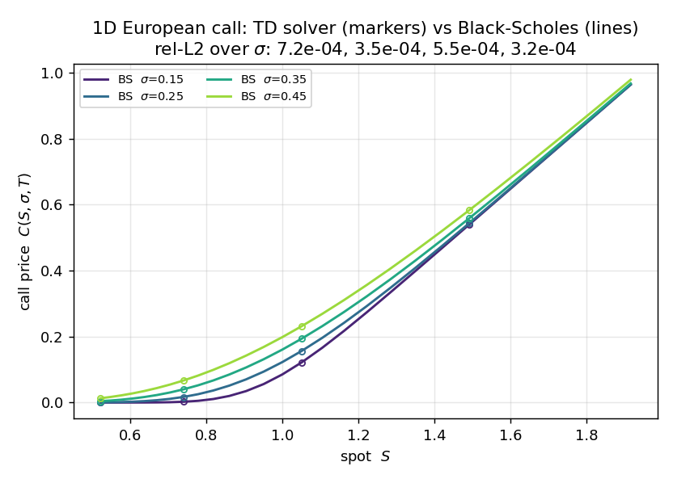
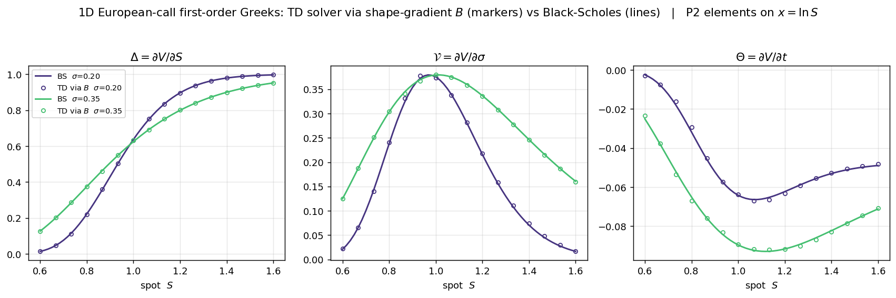
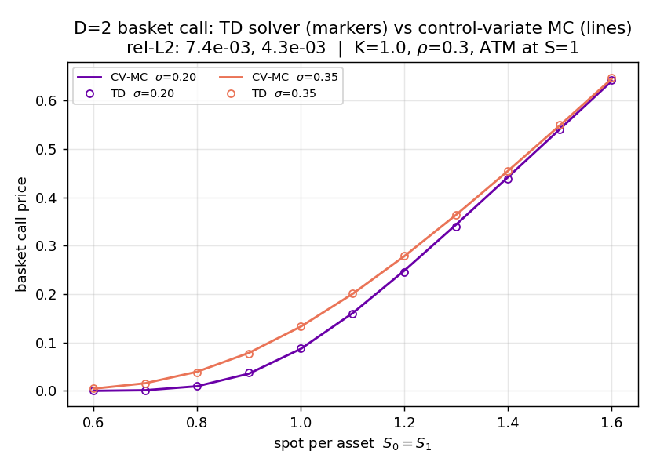

# tdbs — Tensor-Decomposition Black–Scholes Pricer

Price European options by solving the Black–Scholes PDE **once** as a low-rank
**separated representation** over *Space × Parameter × Time*, using finite-element operators. After a single
offline solve, the **entire volatility surface** is available and any single price is a
microsecond tensor contraction — no re-solve per `σ`. The algorithm is published in ICML https://proceedings.mlr.press/v267/guo25p.html 

Two pricers are included:

| Example | Option | Axes | Solver |
|---|---|---|---|
| `examples/price_1d.py` | 1D vanilla call | `(x, σ, τ)` | greedy PGD subspace iteration |
| `examples/price_2d.py` | D=2 parametric basket call | `(x₀, x₁, σ₀, σ₁, τ)` | nested joint fixed-rank ALS |

## Results

**1D vanilla call** — the separated-representation solver reproduces the closed-form
Black–Scholes price across the whole volatility range from a *single* offline solve
(markers = TD solver, lines = analytic Black–Scholes):



**First-order Greeks — for free from the same solve.** The separated solution *is* a
finite-element field, so its Greeks follow by swapping each shape function `N` for its
derivative `B` in the differentiated direction — Δ = ∂V/∂S, 𝒱 = ∂V/∂σ, Θ = ∂V/∂t — with no
bump-and-reprice and no second model. They track closed-form Black–Scholes across the whole
surface (markers = TD via `B`, lines = analytic; quadratic **P2** elements on the log-price
axis give an `O(h²)`-accurate Delta):



**D=2 basket call** — priced against control-variate Monte-Carlo across spot at two
volatilities (markers = TD, lines = CV-MC; `rel-L2 ≈ 0.6%`):



**Speed** — after the one-time offline solve, a price is a microsecond CP tensor contraction:

| method | per-price latency | accuracy (rel-L2) |
|---|---|---|
| **TD (this solver), nodal** | **≈ 2 µs / price** | 1D ≈ 5e-4 vs analytic; basket ≈ 0.6% vs MC (near-the-money) |
| Monte-Carlo (300k paths + control variate) | ≈ 20 ms / price | — |

The offline solve (D=2, `Nx=90`, `Ns=Nt=50`, ranks 19/80, σ-mesh padded) takes ≈ 36 s on a
laptop CPU and is amortized after **~1,700** priced points; every price after that is
**~10⁴× faster** than re-running Monte-Carlo, and the *entire* volatility surface is
available at once. Regenerate the figures and benchmark with
`pip install -e ".[figures]"` then `python examples/make_figures.py`.

## The idea

Write the option value `u(x, σ, τ)` (log-price `x = ln S`, volatility `σ`, time-to-maturity
`τ = T − t`) as a sum of separable products

```
u(x, σ, τ) ≈ Σ_m  X_m(x) · Σ_m(σ) · T_m(τ)        (rank-m CP / separated form)
```

The transformed, constant-in-`x` governing equation is

```
∂u/∂τ  −  ½ σ² ∂²u/∂x²  −  (r − q − ½σ²) ∂u/∂x  +  r u  =  0,
```

with the terminal payoff entering as the **initial condition at `τ = 0`**. Discretising each
1D axis with Lagrange finite elements (linear **P1** or quadratic **P2**) turns the weak form
into a **Kronecker sum** of 1D operators:

```
time       :  M_x  ⊗  M_σ        ⊗  P_τ        (P_τ = Petrov–Galerkin  ∫ N ∂_τ B)
diffusion  :  ½ K_x ⊗  W_σ        ⊗  M_τ        (W_σ = σ²-weighted mass)
advection  :  A_x  ⊗  (−(r−q)M_σ + ½W_σ) ⊗ M_τ
reaction   :  r M_x ⊗  M_σ        ⊗  M_τ
```

The separated solution is then found by alternating least squares (PGD / subspace iteration).
The **log-price + time-reversal** convention is what keeps the operator separable: `σ` enters
only through `σ`-weighted mass matrices (not as an `x`-dependent coefficient), so no
`σ`-dependent Petrov–Galerkin weighting is needed.

### Baskets (D ≥ 2)

The basket payoff `max(Σ_a w_a S_a − K, 0)` couples the asset axes through a curved kink. The
solver uses a **nested hierarchy**: 1-asset subproblems are solved first and *lifted* into the
boundary data of the 2-asset problem (a transfinite/Boolean lift matching the payoff IC, the
deep-in-the-money asymptote, and the lower-asset solutions on the faces). Each subproblem is
solved by **fixed-rank joint ALS** in CP form.

## Install

```bash
git clone https://github.com/jiachenguoNU/td-blackscholes
cd td-blackscholes
pip install -e .          # numpy, scipy, jax (CPU is fine)
# optional GPU direct solver (cuDSS via nvmath):  pip install -e ".[gpu]"
```

The examples also self-add the repo root to `sys.path`, so `python examples/price_1d.py`
works from a fresh clone without installing.

> **Compiled solver module.** The core subspace solver (`tdbs/joint_als`) is distributed as
> a **precompiled CPython extension** (`*.so`), not Python source. The prebuilt binary targets
> **Linux x86-64 / CPython 3.12** — on a different OS, CPU architecture, or Python version the
> import will fail. Every other module is plain, readable Python. For source access or a build
> for another platform, contact the author (non-commercial terms — see [LICENSE](LICENSE)).

## Usage

```bash
python examples/price_1d.py       # 1D call vs analytic Black–Scholes (per-sigma rel-L2)
python examples/price_2d.py       # D=2 basket vs control-variate Monte-Carlo (per-sigma rel-L2)
python examples/make_figures.py   # regenerate the figures + the benchmark below
```

`make_figures.py` prints, e.g.:

```
D=2 basket | Nx=90, Ns=Nt=50 | ranks 19/80 | offline solve 35.9s
TD nodal price (CP contraction)   :       2.01  us / price
Monte-Carlo (300k paths + CV)     :     21.782  ms / price
-> TD is ~10,813x faster per query after the one-time solve
```

Minimal API:

```python
import numpy as np
from tdbs import solve_basket_2d, solve_call_1d, price_at, basket_cv_mc

# --- D=2 basket: one offline solve prices the whole surface ---
res = solve_basket_2d(Nx=90, Ns=50, Nt=50, rank1=19, rank2=80, niter=100, sig_pad=0.05)
V, M = res['V'], res['M']
price = price_at(V, 2, [1.0, 1.0], [0.25, 0.25], res['T'], M)   # ATM, both σ=0.25 (FE reconstruction)
mc    = basket_cv_mc(np.ones(2), np.array([0.25, 0.25]), res['K'], res['r'],
                     res['q'], res['w'], res['rho'], res['T'])         # validation reference

# --- 1D vanilla call (Lagrange FE, P1 or P2): one offline solve -> off-grid prices AND Greeks ---
from tdbs import interp_price, greeks_1d
res1 = solve_call_1d(nelem_x=100, nelem_s=100, nelem_t=100, order={'x': 2})  # P2 on x = ln S
p = interp_price(res1, S=1.0, sigma=0.27, tau=1.0)            # off-grid price (FE reconstruction)
g = greeks_1d(res1, S=1.0, sigma=0.27, tau=1.0)              # {'price','delta','vega','theta'} via B
```

## Repository layout

```
tdbs/
  fem.py              Lagrange (P1/P2) finite-element shape functions, 1D matrices & sparse assembly
  bs_assembly.py      σ^p-weighted mass-matrix assembly
  generate_mesh.py    uniform 1D meshes
  nd_bs.py            separated-representation operator term-lists (Kronecker structure)
  nd_bs_cp.py         CP (canonical-polyadic) tensor algebra + rounding
  nd_bs_param.py      parametric SPT build, nested lift, level solve & hierarchy
  joint_als.*.so      joint fixed-rank ALS sub-solver — COMPILED CPython extension (binary; source not included)
  solver1d.py         1D greedy-PGD alternating sweep
  pricer_1d.py        high-level 1D call pricer  (solve_call_1d, P1/P2; interp_price + greeks_1d off-grid)
  pricer_2d.py        high-level D=2 basket pricer + sigma-mesh padding  (solve_basket_2d, P1/P2)
  evaluate.py         off-grid basket pricing by FE reconstruction of the CP solution  (price_at)
  reference.py        closed-form BS (price + Greeks) + control-variate Monte-Carlo references
examples/
  price_1d.py         1D vanilla call vs analytic Black–Scholes
  price_2d.py         D=2 basket call vs control-variate Monte-Carlo
  make_figures.py     regenerate the README figures + the speed/accuracy benchmark
```

## Accuracy notes

A few properties of this solver are worth knowing:

- **Rank is not monotone.** The subspace iteration updates all modes together at a *fixed*
  rank, so it is not a greedy enrichment — *over-ranking makes the price worse, not better.*
  The 1D call is genuinely low separated-rank: ~10 modes gives `rel-L2 ≈ 1e-4`, while rank 24
  degrades it to `~1e-1` (the surplus modes fit noise and the slowly-decaying kink tail). Use a
  modest rank and increase it only with care. (The `solve_call_1d` default is 10.)
- **The payoff kink dominates discretisation error.** The price is `C⁰` (slope-discontinuous)
  at the strike, which is intrinsically higher-rank; resolving it needs adequate log-price
  (`x`) resolution — refine `nelem_x` or grade the mesh near the kink, not the `σ`/`τ` axes.
- **Report errors near the money.** Over a `[0.5, 2]K` band the basket matches Monte-Carlo to
  `~0.6%` and the 1D call matches analytic BS to `~1e-4`; a wider band that includes the deep
  out-of-the-money tail inflates *relative* error because the true value there is ~0.
- **A deterministic sine-mode initialisation** is used instead of a random start, which avoids
  the local-minimum lottery of the alternating least-squares iteration.
- Higher volatilities are easier (diffusion smooths the kink).

## Citation

This implements the tensor-decomposition (separated-representation) option-pricing method published at **ICML 2025**:
<https://proceedings.mlr.press/v267/guo25p.html>. If you use this code in academic work,
please cite that paper.

## License

**PolyForm Noncommercial License 1.0.0** — see [LICENSE](LICENSE).

You may use, run, modify, and share this software for **non-commercial purposes**
(research, teaching, personal study, and use by academic / non-profit / government
institutions), provided the copyright notice is preserved. **Commercial use is not
permitted** without a separate license from the author. The software is provided "as is",
without warranty. For commercial licensing, contact the author.
